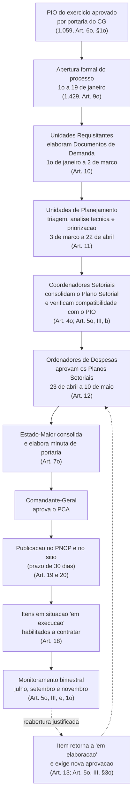

# Benchmarking PMDF — Estudo de Caso, Análise SWOT e Recomendações

> Documento de análise incorporado à documentação do projeto. Compara o arranjo normativo de
> planejamento de contratações e orçamento da **Polícia Militar do Distrito Federal (PMDF)** com o
> do **CBMDF**, mapeado em [mapeamento_processo_as_is.md](mapeamento_processo_as_is.md), e conclui
> com recomendações em duas trilhas — produto e norma.
>
> **Estado:** análise. As recomendações da §6 **não estão aprovadas** e nada aqui foi incorporado ao
> [Documento de Visão](documento_de_visao.md). Serve para embasar a decisão do Comitê e da Direção.

---

## 1. Objetivo, método e fontes

### 1.1 Por que a PMDF

O CBMDF Marketplace se define como **camada de governança e planejamento das contratações**, e sua
causa-raiz declarada é a *"ausência de um sistema institucional de governança que transforme o
planejamento das contratações em um processo contínuo"* (§2.2 do Documento de Visão). Até aqui, o
projeto sustentou essa tese com duas fontes: as próprias normas do CBMDF e a
[pesquisa com 20 servidores](pesquisa_servidores_2026.md). Falta uma **referência externa
comparável**.

A PMDF é o par natural, e por razões estruturais, não de conveniência:

- **Mesmo ente federativo** — sujeita ao mesmo ciclo LDO/LOA do Distrito Federal e ao mesmo
  Decreto distrital nº 44.330/2023;
- **Mesma lei geral** — Lei nº 14.133/2021, com as mesmas obrigações de PCA e de publicidade no PNCP;
- **Mesmo órgão gerenciador** — a Secretaria de Estado de Economia/DF consolida o PCA de ambas;
- **Mesma natureza institucional** — corporação militar com Comandante-Geral, Estado-Maior,
  Ordenadores de Despesas e unidades operacionais dispersas territorialmente.

Isso torna a comparação legítima: quando os dois arranjos divergem, a divergência é **escolha de
desenho**, não consequência de contexto legal distinto.

### 1.2 Método

Leitura normativa comparada, eixo a eixo. Cada afirmação sobre a PMDF cita o artigo e a portaria de
origem entre parênteses, na mesma convenção do mapeamento AS-IS. A contraparte do CBMDF é reusada de
[mapeamento_processo_as_is.md](mapeamento_processo_as_is.md) (Portarias CBMDF nº 17, 18 e 34/2025),
e as afirmações sobre o produto são ancoradas no Documento de Visão ou no código.

O que este método **não** entrega está declarado na §7.

### 1.3 Fontes

| Fonte | Instrumento | O que regula |
|---|---|---|
| [Portaria PMDF nº 1.059/2017](https://atosnormativos.pm.df.gov.br/portarias-normativas/portaria-pmdf-n-1-059-de-31-de-agosto-de-2017/) | Normas da atividade orçamentária e financeira | SIOF/PMDF, Coordenador Setorial de Orçamento, **PIO**, EPROJ |
| [Portaria PMDF nº 1.341/2024](https://atosnormativos.pm.df.gov.br/portarias-normativas/portaria-pmdf-no-1-341-de-08-de-janeiro-de-2024/) | PDLOGS 2023–2026 | Plano Diretor de Logística e Sustentabilidade |
| [Portaria PMDF nº 1.429/2025](https://atosnormativos.pm.df.gov.br/portarias-normativas/portaria-pmdf-no-1-429-de-08-de-outubro-de-2025/) | SPCA/PMDF | Elaboração, priorização, revisão e monitoramento do **PCA** |

---

## 2. Ficha das três portarias

### 2.1 Portaria PMDF nº 1.059, de 31/08/2017 — a camada orçamentária

**Ementa:** estabelece normas para a atividade orçamentária e financeira e cria a função de
Coordenador Setorial de Orçamento. Publicada no BCG nº 185, de 02/10/2017. Revogou a Portaria
nº 783/2012.

- **SIOF/PMDF** (Art. 5º) — Sistema de Orçamento e Finanças, composto por Estado-Maior (órgão
  central), Ordenadores de Despesas, Coordenadores Setoriais de Orçamento, Auditoria e OPM
  designadas no Plano Interno.
- **Coordenador Setorial de Orçamento** (Art. 2º) — papel individualizado com 14 atribuições, entre
  elas alinhar o plano estratégico no detalhamento das ações orçamentárias (inc. I), propor demandas
  ao Ordenador (inc. II), velar pela correta aplicação dos créditos (inc. III), acompanhar
  processos licitatórios (inc. IV) e aprovar Projetos Básicos/TR (inc. XIII).
- **PIO — Plano Interno do Orçamento** (Art. 6º) — aprovado por **portaria normativa do
  Comandante-Geral a cada exercício financeiro** (§1º), detalha os projetos/atividades decorrentes
  da LOA e organiza o orçamento em **11 áreas temáticas** (§3º). Cada Coordenador Setorial elabora a
  **Proposta Setorial do PIO** conforme calendário fixado em **Nota Técnica do Estado-Maior** (§2º).
- **Seção de Orçamento do EM** (Art. 8º) — elabora as propostas de PPA, LOA e do próprio PIO
  (inc. I), produz informações gerenciais (inc. IV) e pode remanejar recursos no Plano Interno com
  anuência do Ordenador (§1º).
- **Reuniões do SIOF** (Art. 9º) — ordinárias **semestrais**, extraordinárias quando necessário.
- **EPROJ** (Art. 10) — Escritório de Projetos com sistema informatizado e metodologia de gestão de
  portfólio em cinco fases: iniciação, planejamento, monitoramento e controle, execução e
  encerramento.
- **Delegação** (Art. 14) — o Chefe do Estado-Maior pode baixar Instrução Normativa e deve
  estabelecer um Manual de Orçamento e Finanças.

> **Nota de leitura sobre o Art. 3º.** O artigo nomeia os Coordenadores Setoriais por área temática,
> mas a redação consolidada é instável: as leituras divergem entre 12 e 13 posições, contra as 11
> áreas temáticas do Art. 6º, §3º. A causa está declarada na própria norma — cinco alterações
> posteriores (Portarias 1.061/2017, 1.147/2020, 1.171/2021, 1.192/2021 e 1.287/2022) sobrescreveram
> incisos do corpo do texto. Essa instabilidade **é um achado**, não uma lacuna desta pesquisa, e
> volta na §5 (Ameaças) e na §6.3.

### 2.2 Portaria PMDF nº 1.341, de 08/01/2024 — a camada de plano diretor

**Ementa:** aprova o Plano Diretor de Logística e Sustentabilidade (PDLOGS/PMDF) para 2023–2026.
Publicada no BCG nº 020, de 29/01/2024. Processo SEI-GDF nº 00054-00014224/2023-12.

- **Art. 2º** — o PDLOGS é **desdobramento do Plano Estratégico Institucional (2023–2034)**: traduz
  a estratégia de longo prazo em orientações sobre procedimentos, atividades e investimentos
  logísticos.
- **Art. 3º** — vinculação obrigatória: os órgãos da PMDF **deverão regular suas ações** de logística
  e sustentabilidade em consonância com o PDLOGS.
- **Art. 5º** — os recursos do plano são **atualizados anualmente mediante consolidação do PIO**,
  observados o PPA e a LOA. É o elo formal entre plano diretor e orçamento.
- **Art. 6º** — omissões e correções são equacionadas pelo Chefe do Departamento de Logística e
  Finanças, ouvido o Chefe do Estado-Maior.
- **Art. 7º** — revoga o inciso III do art. 1º da Portaria nº 1.141/2020. Vigência quadrienal.

> O quadro de ações consta de **Anexo em PDF** ("PDLOGS_FINALIZADO"), cujo conteúdo não foi
> recuperável pelo texto da página. Não é possível afirmar, portanto, se o anexo fixa metas,
> indicadores, responsáveis ou valores por ação. A lacuna fica registrada em vez de inferida.

### 2.3 Portaria PMDF nº 1.429, de 08/10/2025 — a camada de contratações

**Ementa:** estabelece diretrizes, procedimentos e prazos para elaboração, consolidação,
priorização, revisão e monitoramento do PCA. Publicada no BCG nº 191, de 13/10/2025. Fundamento:
Lei nº 6.450/1977, Lei nº 14.133/2021 e Decreto distrital nº 44.330/2023.

Estrutura de atores do **SPCA/PMDF** (Art. 4º e 5º):

| Ator | Competência | Base |
|---|---|---|
| **Comandante-Geral** | Aprova a portaria final do PCA | Preâmbulo; Art. 7º |
| **Estado-Maior** (Unidade Gestora Estratégica) | Supervisiona o SPCA, coordena a abertura do processo, recebe a versão final, elabora a minuta de portaria e monitora os registros | Art. 5º, V; Art. 7º |
| **Ordenadores de Despesas** (Chefes dos Deptos. de Logística/Finanças e de Saúde) | Gerem os créditos, analisam e **aprovam os Planos Setoriais** | Art. 5º, IV; Art. 12 |
| **Coordenadores Setoriais de Orçamento** | Consolidam as demandas no Plano Setorial; definem limites e prioridades; solicitam reabertura | Art. 4º; Art. 6º; Art. 13 |
| **Unidades de Planejamento de Contratações** | Orientam os requisitantes, analisam coerência, priorizam e consolidam | Art. 5º, II |
| **Unidades Requisitantes** | Identificam e formalizam necessidades via Documento de Demanda | Art. 5º, I |

Regras estruturantes:

- **Compatibilidade com o PIO** (Art. 3º, II) — o PCA deve ser *"compatível com a dotação
  orçamentária prevista no Plano Interno de Orçamento"*; os Coordenadores verificam essa
  compatibilidade (Art. 5º, III, "b").
- **Tetos por área temática** (Art. 6º, §1º) — limites e prioridades *"serão definidos com base nos
  tetos orçamentários de cada área"*.
- **Alinhamento estratégico** (Art. 6º, II) — as demandas devem alinhar-se ao Plano Estratégico
  Institucional **e aos Planos Diretores das respectivas áreas temáticas**.
- **Máquina de estados** (Art. 18 e Art. 5º, III, §3º) — só se consideram previstas no PCA as
  demandas em situação **"em execução"** com aprovação formal registrada no sistema; a reabertura
  devolve o item a **"em elaboração"** e exige nova aprovação.
- **Reabertura formalizada** (Art. 13) — durante a execução, os Coordenadores podem solicitar, de
  forma justificada, reabertura para inclusão, exclusão ou redimensionamento de itens, nas hipóteses
  do Decreto nº 44.330/2023.
- **Pré-requisito para ARP** (Art. 3º, V) — a previsão no PCA é pré-requisito para participar de
  atas de registro de preços; as IRP exigem registro prévio do item no PCA do ano corrente.
- **Monitoramento bimestral** (Art. 5º, III, "e", 1º) — relatórios com entregas mínimas em
  **julho, setembro e novembro**.
- **Transparência** (Art. 19 e 20) — disponibilização automática no PNCP e publicação do endereço de
  acesso no sítio institucional em até **30 dias**.
- **Delegação** (Art. 22) — o Chefe do Estado-Maior pode editar Instrução Normativa de aplicação.

---

## 3. Estudo de caso — o arranjo PMDF ponta a ponta

### 3.1 A tese: quatro camadas em que cada uma é condição de entrada da seguinte

O que distingue o arranjo da PMDF não é nenhuma das camadas isoladamente — é o **encadeamento
declarado** entre elas:

```
Plano Estratégico Institucional (2023–2034)
        └── PDLOGS — plano diretor temático quadrienal        (1.341/2024, Art. 2º)
                └── PIO — teto anual por área temática         (1.059/2017, Art. 6º; 1.341, Art. 5º)
                        └── PCA — o que contratar no exercício (1.429/2025, Art. 3º, II e Art. 6º)
```

A estratégia gera o plano diretor (Art. 2º, 1.341); o plano diretor é **orçado** pela consolidação
anual do PIO (Art. 5º, 1.341); o PIO fixa o teto por área temática (Art. 6º, §1º, 1.429); e o PCA só
é válido se **compatível com esse teto** (Art. 3º, II, 1.429) e **alinhado ao plano diretor da área**
(Art. 6º, II, 1.429).

A consequência prática é a que interessa a este projeto: na PMDF, **o teto existe antes da demanda**.
O requisitante e o Coordenador Setorial trabalham dentro de um limite conhecido, porque o PIO é
aprovado por portaria própria a cada exercício (Art. 6º, §1º, 1.059) e é insumo — não produto — do
PCA.

### 3.2 Ciclo anual do PCA/PMDF



### 3.3 Três mecanismos que merecem atenção

**a) O estado do item como controle, não como rótulo.** Na PMDF, `"em execução"` não descreve o
item — **habilita** a contratação (Art. 18). Sair desse estado por reabertura (Art. 13) retira a
habilitação até nova aprovação (Art. 5º, III, §3º). O planejamento deixa de ser um documento que se
consulta e passa a ser um **gate** que se atravessa.

**b) A reabertura tem porta de entrada.** A norma prevê que o PCA será alterado durante a execução e
define quem pede, com que justificativa e qual o efeito sobre o item (Art. 13). Não é exceção
tolerada: é caminho previsto, com custo processual explícito.

**c) O PCA é pré-requisito para a ARP.** O Art. 3º, V fecha a via de escape mais comum do
planejamento — aderir a uma ata alheia para contratar aquilo que não se planejou. Sem registro
prévio no PCA do ano corrente, não há IRP.

---

## 4. Comparativo CBMDF × PMDF, eixo a eixo

| # | Eixo | PMDF | CBMDF | Leitura |
|---|---|---|---|---|
| 1 | **Janela do requisitante** | Documento de Demanda de 1º/jan a 2/mar — cerca de **9 semanas** (Art. 10, 1.429) | DFD até 1º/abr, sem data de abertura fixada (Art. 9º, Port. 18) | A PMDF delimita início e fim; o CBMDF só o fim |
| 2 | **Janela de análise técnica** | 3/mar a 22/abr — cerca de **7 semanas** (Art. 11, 1.429) | Áreas técnicas de 1º/abr a 20/abr — cerca de **3 semanas** (Art. 11, §3º, Port. 18) | A PMDF dá mais que o dobro do tempo para a etapa que exige mais julgamento técnico |
| 3 | **Teto antes da demanda** | PCA **compatível com o PIO**, que é anterior e aprovado por portaria própria (Art. 3º, II e Art. 6º, §1º, 1.429; Art. 6º, §1º, 1.059) | PARF é **posterior** ao PCA: PCA (maio) → PARF 1ª versão (15/jun) → POA (Art. 6º e 12, Port. 17) | **Achado central.** Na PMDF o teto é insumo; no CBMDF é produto |
| 4 | **Papel setorial nomeado** | **Coordenador Setorial de Orçamento**, por área temática, com 14 atribuições (Art. 2º e 3º, 1.059) | Áreas técnicas (COMOP, DITIC, DIREN, DISAU, DIMAT) como **órgãos**, sem titular individualizado equivalente (Art. 5º e 11, Port. 18) | A PMDF tem um responsável; o CBMDF tem um endereço |
| 5 | **Estado do item de PCA** | "em elaboração" ↔ "em execução", com efeito jurídico (Art. 18 e Art. 5º, III, §3º, 1.429) | Não há estado do item de PCA; o pedido tem status de tramitação, mas o PCA é lista, não máquina de estados | A PMDF controla; o CBMDF descreve |
| 6 | **Gate de execução** | Contratar exige situação "em execução" **e** aprovação do Ordenador registrada no sistema (Art. 18, 1.429) | *"As demandas constantes do PCA são previamente aprovadas"* (Art. 20, Port. 18), sem verificação sistêmica | A PMDF condiciona no sistema; o CBMDF confia no documento |
| 7 | **Reabertura / nova versão** | Prevista, com autor, justificativa e efeito definidos (Art. 13, 1.429) | O PARF chegou à **4ª versão** sem janela formal — a norma prevê 3 (Portaria 34/2025 × Art. 12–14, Port. 17) | A PMDF normatiza o que o CBMDF já pratica sem previsão |
| 8 | **Pré-requisito para ARP** | Registro prévio no PCA é condição para IRP e adesão (Art. 3º, V, 1.429) | Épico 05 gere ARPs, mas sem vínculo obrigatório com o PCA | Via de escape aberta no CBMDF |
| 9 | **Ancoragem estratégica** | Demanda alinhada ao Plano Estratégico **e ao Plano Diretor da área temática** (Art. 6º, II, 1.429; Art. 2º e 3º, 1.341) | O vínculo demanda→PLANES está previsto na **HU10.3** (Épico 10), mas o alinhamento estratégico **não pontua** no score do Épico 08 | Convergência parcial: o dado passa a existir; falta usá-lo na decisão |
| 10 | **Monitoramento periódico** | Bimestral, entregas em jul/set/nov (Art. 5º, III, "e", 1º, 1.429) | Relatórios de risco a partir de julho, apresentados em jul/set/nov (Art. 21, Port. 18) | **Convergência plena** — valida o rito já desenhado |
| 11 | **Segregação de funções** | Princípio declarado no caput (1.429) | **Executado em tela**: quem declara ≠ quem pontua; aprovador ≠ solicitante (HU08.1 e HU08.4) | A PMDF declara; o CBMDF implementa |
| 12 | **Indicadores** | Não define métricas, linha de base nem meta | 5 KPIs com linha de base, meta, prazo e fonte (§8 do Documento de Visão) | Força clara do CBMDF |
| 13 | **Sistema de suporte** | Delegado ao *"sistema eletrônico de compras (DF ou federal)"* + SEI + PNCP | Camada própria de orquestração, cliente de Grifo, SIAFI, SEI e PNCP (§4.1 do Documento de Visão) | Escolha arquitetural — é o diferencial e é o risco |
| 14 | **Portfólio e projetos** | EPROJ com ciclo de cinco fases (Art. 10, 1.059) | SEGEP e gerente de projeto para projetos estratégicos e emendas (Art. 25–27, Port. 18) | Convergência |
| 15 | **Governança colegiada** | Reuniões ordinárias **semestrais** do SIOF (Art. 9º, 1.059) | Ciclos **quadrimestrais** com ata e fotografia congelada (HU08.3) | O CBMDF é mais frequente — e a frequência é o ponto da causa-raiz |
| 16 | **Veículo de detalhamento** | IN do Chefe do Estado-Maior (Art. 14, 1.059; Art. 22, 1.429) + Nota Técnica para o calendário (Art. 6º, §2º, 1.059) | Previsão equivalente nas portarias do CBMDF | Boa notícia operacional: parte das mudanças não exige portaria do CG |

### 4.1 O achado central, explicado

O eixo 3 merece parágrafo próprio porque é onde o benchmark encontra a dor mais citada da pesquisa
de campo.

No CBMDF, a sequência normativa é **PCA → PARF → POA** (§2 do AS-IS): o requisitante envia o DFD até
1º de abril, o PCA é aprovado na 1ª quinzena de maio e só então o PARF é elaborado a partir dele
(Art. 6º, Port. 17), com a 1ª versão até 15 de junho (Art. 12, Port. 17). Ou seja: **quando a demanda
é formulada, o teto ainda não existe** — ele será construído a partir da soma das demandas.

Na PMDF a ordem é inversa. O PIO é aprovado por portaria própria para cada exercício (Art. 6º, §1º,
1.059) e o PCA precisa ser compatível com a dotação nele prevista (Art. 3º, II, 1.429), com limites
e prioridades definidos com base nos **tetos orçamentários de cada área** (Art. 6º, §1º, 1.429).

Isso descreve, com precisão, o mecanismo que 75% da amostra do CBMDF relatou como dificuldade
principal — *limitações orçamentárias ou indefinição de recursos* (§2.1 da pesquisa). O GPRAM
descreveu a consequência: sem teto conhecido, o PCA vira *"lista de papai noel"*, e o grupamento
*"não chegou a executar 10 milhões no último ano [e] costuma ter um PARF de 50"* (§5.2-A da
pesquisa). A pesquisa já havia concluído que **pedir sem teto conhecido não é indisciplina, é a
única estratégia racional para quem não sabe o limite**. O benchmark acrescenta o dado que faltava:
a corporação-irmã, sob a mesma lei e no mesmo ente, resolveu isso **normativamente** — e o fez em
2017.

---

## 5. Análise SWOT do CBMDF à luz do benchmark

Cada item está ancorado em um artigo de portaria, em um achado da pesquisa de campo, em uma seção do
Documento de Visão ou no código. Itens sem âncora foram descartados.

### Forças

| # | Força | Âncora |
|---|---|---|
| F1 | **Indicadores com linha de base, meta, prazo e fonte** — 5 KPIs cobráveis, com protocolo de coleta da linha de base e limites de cobertura declarados | §8, §8.1–8.3 do Documento de Visão — contra a ausência de qualquer métrica nas três portarias da PMDF |
| F2 | **Segregação de funções executada, não apenas declarada** — requisitante declara criticidade e risco; Planejamento declara obrigatoriedade legal e prontidão; aprovador ≠ solicitante | HU08.1 e HU08.4; a PMDF traz a segregação como princípio no caput da 1.429, sem mecanismo |
| F3 | **Trilha de auditoria implementada** — ponto único de mutação grava estado anterior, novo, data, autor, perfil, tela de origem e justificativa | §6.3 do Documento de Visão |
| F4 | **Rito mais frequente que o do benchmark** — ciclos quadrimestrais com ata e fotografia congelada, contra reuniões semestrais do SIOF | HU08.3 × Art. 9º da 1.059 |
| F5 | **Fronteira arquitetural explícita** — "planejar e governar × executar" delimitada e documentada, o que evita a disputa de escopo com Grifo, SISGEPAT e SIAFI | §1.2 e §4.1 do Documento de Visão; [analise_escopo_erp.md](analise_escopo_erp.md) |
| F6 | **Priorização com pesos institucionais fixos e decompostos** — score 40/30/20/10 com desempate estável e explicação em tela | `src/js/governanca.js:13-16`; validado em campo pelo SELOG/COMOP (§3 da pesquisa) |
| F7 | **Janela formal de revisão já implementada** — 15/set–15/nov | `isJanelaRevisao` em `src/js/status-pipeline.js`; Art. 16, I, Port. 18 |

### Fraquezas

| # | Fraqueza | Âncora |
|---|---|---|
| W1 | **Teto orçamentário posterior à demanda** — PCA precede o PARF, então o requisitante planeja sem limite conhecido | Art. 6º e 12 da Port. 17 × Art. 3º, II da 1.429; dor de **75%** da amostra (§2.1 da pesquisa) |
| W2 | **Teto, dotação e prazo existem no sistema e não chegam a quem pede** — os três dados mais solicitados estão restritos aos perfis de gestão | §5.1 da pesquisa; `budget.js`, `dotacao.js` e `audit.js` não são lidos por `acompanhe.js` |
| W3 | **Janela de análise técnica de ~3 semanas** contra ~7 na PMDF, para a etapa que mais exige julgamento | Art. 11, §3º da Port. 18 × Art. 11 da 1.429 |
| W4 | **Ausência de papel setorial nomeado** — a responsabilidade orçamentária setorial recai sobre órgãos, não sobre titulares com atribuições listadas | Art. 5º e 11 da Port. 18 × Art. 2º e 3º da 1.059 |
| W5 | **O PCA não é máquina de estados** — não há situação do item que habilite ou bloqueie a contratação | Art. 20 da Port. 18 × Art. 18 da 1.429 |
| W6 | **Reabertura praticada sem previsão** — o PARF chegou à 4ª versão embora a norma preveja três | Portaria 34/2025 × Art. 12–14 da Port. 17; §8 do AS-IS |
| W7 | **ARP sem vínculo obrigatório com o PCA** — é possível contratar por ata aquilo que não foi planejado | Épico 05 × Art. 3º, V da 1.429 |
| W8 | **Estratégia não pontua na priorização** — a HU10.3 cria o vínculo da demanda ao objetivo do PLANES, mas ele não entra no score que ordena a fila | Épico 08 e HU10.3 × Art. 6º, II da 1.429 |
| W9 | **Matriz GUT replicada manualmente e sem padrão entre setoriais** — cada setorial recalcula a fórmula na planilha | §8 do AS-IS; SELOF: *"tudo fica priorizado ou fica muito diferente de demandante pra demandante"* (§3 da pesquisa) |
| W10 | **Comunicação direcionalmente ruim** — média 2,85/5, caindo a 1–2 nas unidades da ponta | §2.2 da pesquisa |

### Oportunidades

| # | Oportunidade | Âncora |
|---|---|---|
| O1 | **Precedente institucional no mesmo ente** — propor o teto-antes-da-demanda deixa de ser inovação arriscada e passa a ser alinhamento com a corporação-irmã, sob a mesma lei e o mesmo órgão gerenciador | Art. 3º, II e Art. 6º, §1º da 1.429; Art. 6º da 1.059 |
| O2 | **Veículo normativo rápido disponível** — parte das mudanças cabe em Instrução Normativa do Chefe do EMG, sem nova portaria do Comandante-Geral | Art. 14 da 1.059 e Art. 22 da 1.429; previsão equivalente nas portarias do CBMDF |
| O3 | **Calendário por Nota Técnica** — a PMDF delega as datas do ciclo a Nota Técnica do EM, arranjo que permite recalibrar prazos sem reeditar a portaria | Art. 6º, §2º da 1.059 |
| O4 | **Planejamento Estratégico 2025–2030 já disponível** para virar critério de score e ancoragem de demanda | `docs/indicadores/` × Art. 6º, II da 1.429 |
| O5 | **PDLOGS como modelo replicável** de plano diretor temático que conecta estratégia a orçamento por consolidação anual | Art. 2º e 5º da 1.341 |
| O6 | **Lei nº 14.133/2021 e PNCP como vetor de transparência** — a exigência de publicidade legitima expor internamente o que já será público | Art. 19 e 20 da 1.429; Art. 15, § único da Port. 18 |
| O7 | **Convergência de ritos** — o monitoramento jul/set/nov é idêntico nas duas corporações, o que reduz o atrito de adoção do painel de indicadores | Art. 21 da Port. 18 × Art. 5º, III, "e", 1º da 1.429 |

### Ameaças

| # | Ameaça | Âncora |
|---|---|---|
| T1 | **Imposição de sistema único do GDF ou federal** — a PMDF já delega o suporte ao sistema eletrônico de compras do DF ou da União; se o mesmo for imposto ao CBMDF, um produto próprio precisa se justificar | Art. 5º, III e disposições finais da 1.429 × §4.1 do Documento de Visão. Mitigada — não eliminada — pela escolha de sermos camada de orquestração |
| T2 | **Dependência de integrações fora do nosso controle** — SIAFI, Grifo, SEI e PNCP; sem elas, KPI 5 permanece parcialmente não calculável | RNF da §6.3 e §8.3 do Documento de Visão |
| T3 | **Norma rígida que envelhece** — a 1.059/2017 exigiu cinco alterações, sobretudo para mexer na lista de coordenadores e áreas temáticas fixada no corpo do texto | Portarias 1.061/2017, 1.147/2020, 1.171/2021, 1.192/2021 e 1.287/2022 |
| T4 | **Rastreabilidade como fator de resistência** — a 1.429 nomeia responsabilização civil, penal e administrativa de Coordenadores e Ordenadores; a trilha de auditoria pode ser lida como exposição pessoal antes de ser lida como proteção | Caput e disposições da 1.429 × §6.3 do Documento de Visão |
| T5 | **Teto explícito pode reprimir a demanda real** — se o teto vier sem canal para registrar a necessidade não coberta, a instituição perde a informação sobre o déficit em vez de conhecê-lo | Risco derivado de W1/O1; ver mitigação em **R1** |
| T6 | **Prazos legais que vencem na fila** — a validade de 180 dias da planilha orçamentária (art. 97, Decreto 44.330/2023) faz processos vencerem antes de serem analisados | GPRAM, §5.2-C da pesquisa; Art. 20, §3º da Port. 18 |

---

## 6. O que deveríamos implementar

Duas trilhas separadas de propósito. A trilha de produto é executável pela equipe; a trilha
normativa depende de decisão do Comando. Vários itens só produzem efeito quando as duas andam
juntas — a §6.4 marca quais.

### 6.1 Trilha de produto

**R1 — Teto setorial visível ao requisitante, antes de pedir** *(extensão do Épico 04)*
- **Origem:** eixo 3 e 4.1; espelha o PIO (Art. 6º, §1º, 1.059; Art. 3º, II, 1.429).
- **Dor:** W1 e W2 — 75% da amostra.
- **O que fazer:** expor no catálogo e na montagem do pedido o teto do setor, o comprometido e o
  saldo, com o mesmo cálculo já existente em `budget.js` (`capCusteio`, `saldoCusteio`), hoje
  restrito aos perfis de gestão. Exibir também a lacuna de dotação (`dotacao.js`) e a previsão de
  prazo pelo SLA (`audit.js`, `getSituacaoSla`).
- **Mitigação de T5:** o teto **orienta, não bloqueia**. Pedido acima do teto segue permitido, é
  marcado como *demanda não coberta pelo teto* e é agregado num indicador de déficit por setor —
  a instituição passa a conhecer o tamanho da necessidade reprimida em vez de perdê-la.
- **Custo:** baixo. O dado existe; a mudança é de exposição, não de modelo — exatamente a conclusão
  da §7 da pesquisa.

**R2 — Situação do Item de PCA e gate de execução** *(novo, adjacente ao Épico 08)*
- **Origem:** eixos 5, 6 e 7; espelha os Arts. 13 e 18 da 1.429.
- **Dor:** W5 e W6.
- **O que fazer:** dar ao item de PCA — já materializado por (exercício × classe), conforme HU08.7 —
  uma situação explícita `em elaboração` / `em execução`. Só itens `em execução` habilitam o avanço
  para a Etapa 3 do pipeline (Estruturação — ETP/TR). A reabertura de ciclo devolve os itens
  afetados a `em elaboração`, exige justificativa e nova aprovação, e registra tudo na trilha do
  Épico 02.
- **Efeito colateral desejável:** dá forma sistêmica ao que hoje acontece à margem da norma — a 4ª
  versão do PARF (W6) deixaria de ser anomalia e passaria a ser evento registrado.

**R3 — Alinhamento estratégico como critério do score** *(extensão da HU08.1, sobre a HU10.3)*
- **Origem:** eixo 9; espelha o Art. 6º, II da 1.429 e o Art. 2º da 1.341.
- **Dor:** W8.
- **Relação com o Épico 10:** a **HU10.3** já prevê capturar, no DFD, o vínculo da demanda a um
  objetivo do PLANES vigente, por lista fechada. **R3 não duplica esse campo — consome-o.** A
  recomendação é usar o vínculo já capturado como **quinto critério do score**, redistribuindo os
  pesos hoje fixados em 40/30/20/10 (`governanca.js:13-16`). Sem isso, o produto saberá dizer quanto
  do que se compra serve à estratégia, mas a estratégia continuará sem influir em **qual demanda vem
  primeiro** — que é exatamente o que o Art. 6º, II da 1.429 exige da priorização.
- **A repactuação dos pesos é decisão do Comitê**, não da equipe: este documento propõe a inclusão do
  critério, não o número.
- **Requisitos de coerência:** a decomposição em tela ("Por quê?") precisa continuar somando
  exatamente o total exibido (HU08.1); e demandas **sem vínculo declarado** — previstas na HU10.3
  para os pedidos anteriores à mudança — não podem ser penalizadas como se tivessem sido avaliadas e
  reprovadas nesse critério.

**R4 — Vínculo obrigatório entre ARP e PCA** *(extensão do Épico 05)*
- **Origem:** eixo 8; espelha o Art. 3º, V da 1.429.
- **Dor:** W7.
- **O que fazer:** condicionar a vinculação de um pedido a uma ARP à existência de item
  correspondente no PCA do exercício corrente. Sem correspondência, a operação exige a mesma
  justificativa reforçada da inclusão por urgência (HU08.4), com segundo aprovador.

**R5 — Perfil "Coordenador Setorial de Orçamento"** *(extensão do controle de acesso, §6.3)*
- **Origem:** eixo 4; espelha os Arts. 2º e 3º da 1.059.
- **Dor:** W4 e W10 — dá rosto ao "ponto focal por etapa" pedido por 6 respostas (§5.2-F da pesquisa).
- **O que fazer:** criar o perfil com as atribuições que têm contrapartida no sistema: consolidar a
  proposta setorial, verificar compatibilidade com o teto, priorizar dentro da área e responder pela
  fila setorial. Exibir o titular da área como **ponto focal visível** na tela de acompanhamento.
- **Lição do benchmark (T3):** as áreas temáticas e seus titulares devem viver em **tabela
  parametrizável do sistema**, com trilha de auditoria — nunca fixadas em norma. As cinco alterações
  da 1.059 foram, em boa parte, o custo de ter cravado essa lista no corpo da portaria.

**R6 — Declarar o score como substituto formal da matriz GUT** *(documentação + tela)*
- **Origem:** eixo 4 (papel setorial) e §3 da pesquisa.
- **Dor:** W9.
- **O que fazer:** publicar o mapeamento GUT → score já demonstrado na §3 da pesquisa
  (Gravidade→Criticidade, Tendência→Risco, Maturidade→Prontidão, mais Obrigatoriedade legal) na
  própria tela de governança, para que a substituição seja compreendida como continuidade do método
  que as setoriais já usam — não como imposição de um critério novo.

**R7 — Calendário de contratações com janelas por etapa** *(novo; prioridade média)*
- **Origem:** eixos 1 e 2; espelha os Arts. 9º a 12 da 1.429.
- **Dor:** W3 e T6, além da lacuna C da pesquisa (§5.2-C).
- **O que fazer:** representar no sistema as janelas do ciclo (abertura, requisição, análise técnica,
  aprovação setorial), com contagem regressiva visível ao requisitante e alerta de vencimento da
  validade de 180 dias da planilha orçamentária. Depende de as janelas existirem na norma — ver
  **N1** e **N4**.

### 6.2 Trilha normativa

**N1 — Fixar teto indicativo por setorial antes da abertura da requisição** *(portaria do CG)*
- Espelha o PIO (Art. 6º, 1.059) e o Art. 3º, II da 1.429. É a contrapartida institucional de **R1**:
  sem alguém obrigado a definir o teto antes de abril, o sistema não tem o que exibir. Não exige
  criar um PIO próprio — basta que a Portaria nº 18 condicione a consolidação do PCA a um teto
  indicativo por setorial, publicado no início do ciclo.

**N2 — Antecipar e delimitar a janela de requisição** *(portaria do CG ou IN do EMG)*
- Hoje há apenas prazo final (1º/abr). A PMDF fixa início e fim (Art. 10, 1.429) e concede ~7 semanas
  à análise técnica (Art. 11) contra as ~3 do CBMDF. Corrige W3 e viabiliza **R7**.

**N3 — Criar janela formal de reabertura do PARF** *(portaria do CG)*
- A prática já superou a norma: 4ª versão aprovada onde a Portaria nº 17 prevê três (W6). O Art. 13
  da 1.429 é o modelo — reabertura mediante solicitação justificada, com efeito definido sobre a
  situação do item. Sem isso, **R2** ficaria implementando um estado que a norma não reconhece.

**N4 — Delegar o calendário do ciclo a Nota Técnica do EMG** *(IN do EMG)*
- Espelha o Art. 6º, §2º da 1.059. Permite recalibrar datas a cada exercício sem reeditar portaria —
  e é justamente o que a §8.1 do Documento de Visão prevê para os SLAs, *"a ser calibrada pela CESMA
  e pelo Planejamento após o primeiro quadrimestre"*.

**N5 — Designar Coordenadores Setoriais de Orçamento** *(IN do EMG)*
- Contrapartida de **R5**. Designar por **função**, remetendo a lista de áreas temáticas e titulares
  a ato administrativo revisável — não ao corpo da portaria (lição T3).

**N6 — Padronizar o instrumento de priorização entre setoriais** *(IN do EMG)*
- Contrapartida de **R6**: a GUT aplicada de forma não padronizada (W9) é substituída por critério
  único, com pesos institucionais e decomposição auditável.

**N7 — Fixar prazo de publicação do endereço do PCA no PNCP** *(IN do EMG)*
- Espelha o Art. 20 da 1.429 (30 dias). Baixo custo, ganho direto de transparência e aderência à
  Lei nº 14.133/2021.

### 6.3 O que não copiar da PMDF

Benchmarking honesto também registra o que rejeitar:

- **Listas nominais de coordenadores e áreas temáticas no corpo da portaria.** Custou cinco
  alterações à 1.059 em cinco anos e deixou a redação consolidada ambígua a ponto de leituras
  divergirem sobre quantos coordenadores existem. Parametrizar no sistema (R5).
- **Ausência de indicadores.** Nenhuma das três portarias fixa métrica, linha de base ou meta. O §8
  do Documento de Visão já é superior a esse padrão e não deve ser nivelado por baixo.
- **Delegação integral do suporte sistêmico a sistema de terceiro.** A PMDF opera sobre o sistema
  eletrônico de compras do DF ou da União. É legítimo, mas devolve à instituição exatamente o
  problema que motivou este produto: nenhuma camada própria orquestrando requisitante → área técnica
  → consolidação → aprovação.
- **Rito semestral de governança.** As reuniões do SIOF são semestrais (Art. 9º, 1.059). Nossa
  causa-raiz é a periodicidade insuficiente do planejamento; adotar cadência menor que a
  quadrimestral já implementada seria retroceder.

### 6.4 Priorização e sequenciamento

| Ordem | Item | Trilha | Impacto | Esforço | Depende de |
|---|---|---|---|---|---|
| 1 | **R1** — teto, dotação e prazo visíveis ao requisitante | Produto | **Alto** (75% da amostra) | **Baixo** — o dado já existe | N1 para ter valor real de teto; entrega valor parcial sem ela |
| 2 | **N1** — teto indicativo por setorial antes da requisição | Norma | **Alto** | Médio — decisão do Comando | — |
| 3 | **R6** — score como substituto declarado da GUT | Produto | Médio | **Baixo** — documentação e tela | — |
| 4 | **N7** — prazo de publicação no PNCP | Norma | Baixo | **Baixo** | — |
| 5 | **R5** + **N5** — Coordenador Setorial e ponto focal visível | Ambas | **Alto** (W4, W10, lacuna F) | Médio | Controle de acesso por perfil (§6.3) |
| 6 | **R2** + **N3** — situação do item de PCA e gate de execução | Ambas | **Alto** | **Alto** | HU08.7 (item de PCA por exercício); N3 para respaldo normativo |
| 7 | **R3** — alinhamento estratégico no score | Produto | Médio | **Baixo**, se a HU10.3 já tiver entregue o vínculo | HU10.3 (captura do vínculo) + repactuação dos pesos pelo Comitê |
| 8 | **R4** — ARP condicionada ao PCA | Produto | Médio | Médio | R2 (precisa da situação do item) |
| 9 | **R7** + **N2** + **N4** — calendário com janelas por etapa | Ambas | Médio | **Alto** | N2 e N4 precedem R7 |

**Sequência recomendada.** Começar por **R1**, pelo mesmo motivo da §7 da pesquisa: é a maior dor,
o dado já está no repositório e a mudança é de exposição. **N1** deve seguir imediatamente, porque
sem teto institucional o R1 exibe uma referência frágil. **R6** e **N7** são ganhos baratos que
constroem credibilidade para as conversas mais difíceis. O bloco **R2+N3** é o mais transformador e
o mais caro — e não deve ser iniciado antes da HU08.7, que escopa o item de PCA por exercício.

---

## 7. Limitações declaradas

- **Análise exclusivamente normativa.** Não houve acesso a dados de execução da PMDF: taxa de
  cumprimento dos prazos dos Arts. 9º a 12, número de reaberturas do Art. 13, aderência real ao gate
  do Art. 18 ou grau de preenchimento dos relatórios bimestrais. Uma norma bem desenhada não prova
  um processo que funcione.
- **A própria PMDF revisa muito seu desenho.** A 1.059/2017 recebeu cinco alterações. Isso enfraquece
  a leitura de que seu arranjo esteja estabilizado, e é a razão de a §6.3 existir.
- **O Anexo do PDLOGS não foi lido.** O quadro de ações está em PDF não recuperável pelo texto da
  página; não é possível afirmar se ele fixa metas, indicadores, responsáveis ou valores. Toda
  afirmação sobre o PDLOGS neste documento se restringe ao corpo da Portaria nº 1.341/2024.
- **A 1.429/2025 é recente** — vigora desde 13/10/2025, com o primeiro ciclo completo em 2026. Não há
  histórico que permita avaliar seus efeitos.
- **Assimetria de fontes.** Sobre o CBMDF dispomos de norma, evidência de campo e código; sobre a
  PMDF, apenas norma. A comparação é justa quanto ao desenho e desigual quanto à prática — e nenhuma
  conclusão aqui deve ser lida como afirmação de que a PMDF executa melhor.

As recomendações da §6 valem, portanto, como **hipóteses fundamentadas em precedente institucional**,
não como resultados comprovados.

---

## 8. Relação com os demais documentos

- [Mapeamento do Processo AS-IS](mapeamento_processo_as_is.md) — a contraparte CBMDF de todo o
  comparativo da §4 (Portarias nº 17, 18 e 34/2025).
- [Pesquisa com Servidores](pesquisa_servidores_2026.md) — evidência de campo que ancora W1, W2, W9,
  W10 e a priorização da §6.4; a §5.2-A é o correlato direto do achado central da §4.1.
- [Documento de Visão](documento_de_visao.md) — §2.2 (causa-raiz), Épicos 04, 05 e 08, §6.3 (RNFs) e
  §8 (KPIs) são os pontos de contato das recomendações.
- [Catálogo de Indicadores e OKRs](catalogo_indicadores_okr.md) — Épico 10. A **HU10.3** (vínculo da
  demanda ao objetivo do PLANES) é pré-requisito de **R3**; o catálogo também é o lugar natural para
  os indicadores que **N1** e **R2** passariam a tornar calculáveis.
- [Análise de Escopo — ERP](analise_escopo_erp.md) — a fronteira "planejar e governar × executar" que
  sustenta F5 e delimita T1.

> **Nota de sincronia.** Na data desta análise, o Épico 10 e o catálogo de indicadores estavam em
> elaboração e ainda não incorporados ao ramo principal. As referências a HU10.x acima devem ser
> reconferidas quando aquele trabalho for consolidado.
- [Boas Práticas Orçamentárias, Financeiras e Logísticas](boas_praticas_orcamentaria_financeira_logistica.md) —
  referência externa complementar; este documento é o recorte institucional local dela.
