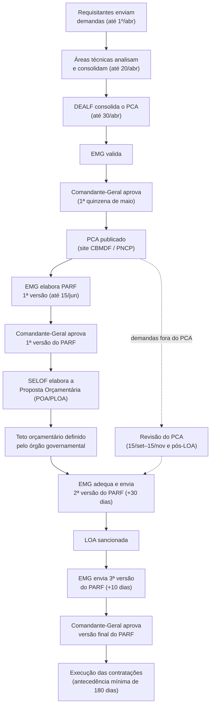

# Mapeamento do Processo AS-IS — Planejamento de Contratações e Orçamento do CBMDF

> Documento de análise incorporado à documentação do projeto. Descreve, com base nas normas
> internas vigentes, **como o CBMDF hoje planeja, orça e formaliza suas contratações** — antes de
> qualquer intervenção do CBMDF Marketplace. Serve de base factual para o Documento de Visão.
> → O estado futuro correspondente está no [Mapeamento do Processo TO-BE](mapeamento_processo_to_be.md).

---

## 1. Objetivo e fontes normativas

Este documento mapeia o processo **AS-IS** (como é hoje) do ciclo de planejamento de contratações e
orçamento do Corpo de Bombeiros Militar do Distrito Federal, a partir de três fontes primárias
disponíveis em `docs/processo_as_is/`:

| Fonte | Instrumento | O que regula |
|---|---|---|
| `PORTARIA_PCA.pdf` | Portaria nº 18, de 30/06/2025 | Elaboração, aprovação, revisão, alteração, execução e monitoramento do **Plano de Contratações Anual (PCA)** |
| `Suplemento_ao_BG_120_..._Portaria_n_17_2025_PARF_POA.pdf` | Portaria nº 17, de 30/06/2025 (revoga a Portaria nº 21/2020) | Elaboração e aprovação do **Plano de Aplicação de Recursos Financeiros (PARF)** e elaboração da **Proposta Orçamentária Anual (POA/PLOA)** |
| `Suplemento-204-29out2025.pdf` | Portaria nº 34, de 28/10/2025 | Exemplo real de **saída** do processo: aprovação da 4ª versão do PARF/2025, com planilha anexa de demandas de todos os órgãos setoriais |

Cada afirmação de prazo, papel ou regra abaixo é rastreável a um artigo específico de uma dessas
portarias, citado entre parênteses.

---

## 2. Visão geral: os três ciclos encadeados

O processo é sequencial e cumulativo dentro de um mesmo exercício de planejamento (ano N para
execução em N+1):

1. **PCA** — consolida *o que* a Corporação pretende contratar (bens, serviços, obras, TI,
   prorrogações) no exercício subsequente (Portaria nº 18, Art. 2º, 7º).
2. **PARF** — a partir do PCA já aprovado, soma as despesas de **pessoal e custeio da folha** e
   consolida *quanto* isso custa, em 3 versões sucessivas ao longo do ano (Portaria nº 17, Art. 2º,
   6º).
3. **POA/PLOA** — usa o PCA + a 1ª versão do PARF + a previsão de receitas para compor a **proposta
   orçamentária** que o CBMDF envia ao órgão consolidador da Lei Orçamentária Anual (Portaria nº 17,
   Art. 1º, 7º-11º).

---

## 3. Papéis e responsabilidades

| Papel / Sigla | Quem é | Responsabilidade principal | Base legal |
|---|---|---|---|
| **Requisitante** | Setor/OBM que identifica a necessidade | Envia a demanda (DFD) até 1º de abril, com justificativa, quantidade, valor estimado, prioridade e vínculos | Art. 4º, XIV e Art. 9º (Portaria 18) |
| **Área técnica** | COMOP, DITIC, DIREN, DISAU, DIMAT | Recebe, analisa, agrupa e padroniza as demandas de sua área; pode reclassificar/incluir/excluir itens | Art. 5º e 11 (Portaria 18) |
| **DEALF** | Departamento de Administração Logística e Financeira | **Gestor do PCA** — elabora e consolida o PCA da Corporação | Art. 3º (Portaria 18) |
| **EMG** | Estado-Maior-Geral | **Coordenador do PCA**; **Coordenador e Gestor do PARF** — valida o PCA, elabora o PARF e a Proposta Orçamentária | Art. 3º (Portaria 18); Art. 3º (Portaria 17) |
| **Comandante-Geral** | Autoridade máxima | Aprova o PCA, aprova (via Portaria) cada versão do PARF, decide sobre alterações extraordinárias | Art. 14-15 (Portaria 18); Art. 12-15 (Portaria 17) |
| **DICOA** | Diretoria de Contratações e Aquisições | Recebe os processos de contratação já instruídos para dar seguimento à licitação | Art. 13, §1º; Art. 20, §1º (Portaria 18) |
| **DIMAT** | Diretoria de Materiais e Serviços | Analisa aspectos formais dos processos, elabora TR/Projeto Básico, pode agrupar processos afins | Art. 23-24 (Portaria 18) |
| **SELOF** | Seção de Logística, Orçamento e Finanças (dentro do EMG) | Elabora, na prática, a Proposta Orçamentária Anual | Art. 8º (Portaria 17) |
| **DIOFI** | Diretoria de Orçamento e Finanças | Fornece dados de execução orçamentária, GSV, reservas de contingência | Art. 6º §2º III; Art. 8º; Art. 18 (Portaria 17) |
| **DIGEP** | Diretoria de Gestão de Pessoal | Fornece dados de folha do pessoal ativo e receitas de identidades | Art. 6º §2º I; Art. 10 (Portaria 17) |
| **DINAP** | Diretoria de Inativos e Pensionistas | Fornece dados de folha de inativos/pensionistas, PTTC/PTTD | Art. 6º §2º II (Portaria 17) |
| **SEGEP** | Seção de Gestão Estratégica e Projetos (dentro do EMG) | Assessora a indicação de gerentes de projetos estratégicos | Art. 25 (Portaria 18) |
| **Gerente de projeto** | Indicado pela área técnica | Acompanha e impulsiona projetos estratégicos ou financiados por emendas parlamentares/recursos externos | Art. 25-27 (Portaria 18) |

---

## 4. Fluxo detalhado do PCA (Plano de Contratações Anual)

O PCA é o instrumento que **consolida todas as contratações que o CBMDF pretende realizar no
exercício seguinte** — compras, obras, serviços (inclusive TI e engenharia), prorrogações
contratuais e contratações diretas dos Art. 74/75 da Lei 14.133/2021 (Art. 2º, 7º, 8º).

### 4.1 Cronograma anual (Anexo Único, Portaria 18)

| Período | Etapa | Artigo |
|---|---|---|
| Até 1º de abril | Requisitantes enviam demandas às áreas técnicas por instrumento padronizado | Art. 9º |
| Até 20 de abril | Áreas técnicas analisam, agrupam e encaminham as demandas ao DEALF | Art. 11, §3º |
| Até 30 de abril | DEALF consolida o PCA e envia ao EMG para validação | Art. 13, §3º |
| Até a 1ª quinzena de maio | Comandante-Geral aprova o PCA | Art. 15 |
| Até a 1ª quinzena de maio | Divulgação no site do CBMDF e, quando aplicável, no PNCP | Art. 15, § único |
| 15 de setembro a 15 de novembro | Revisão do PCA para adequação à proposta orçamentária enviada ao Legislativo | Art. 16, I |
| Quinzena seguinte à publicação da LOA | Adequação do PCA ao orçamento aprovado | Art. 16, II |
| Durante o ano de execução | Alteração do PCA mediante justificativa aprovada pelo Comandante-Geral | Art. 17 |
| Antecedência mínima de 180 dias (120 dias para ensino) | Formalização e impulsionamento dos processos de contratação | Art. 20, §3º |
| A partir de julho | Elaboração de relatórios de risco sobre contratações que podem não se efetivar | Art. 21 |
| Julho, setembro e novembro | Apresentação bimestral dos relatórios de risco em reunião | Art. 21, §2º |

### 4.2 Da demanda à consolidação

1. **Envio da demanda (DFD):** cada requisitante formaliza a necessidade por instrumento
   padronizado, informando justificativa, descrição, quantidade, valor estimado, data pretendida,
   grau de prioridade e eventuais vínculos com outras demandas (Art. 9º). O requisitante deve
   observar, no mínimo, a classe/grupo do catálogo eletrônico de padronização indicado pelo DEALF
   (Art. 9º, §2º).
2. **Análise pela área técnica:** a área técnica recebe as demandas de todas as OBMs, analisa
   necessidade/viabilidade e as agrupa para evitar fracionamento de despesa e repetição (Art. 11).
   Pode reclassificar, incluir ou retirar itens, com justificativa (Art. 11, §2º).
3. **Consolidação pelo DEALF:** agrega documentos de mesma natureza, adequa o PCA aos objetivos do
   Art. 6º e monta o **calendário de contratação** por grau de prioridade, considerando
   disponibilidade orçamentária e financeira (Art. 13). O calendário já define o prazo de
   tramitação até a DICOA.
4. **Validação pelo EMG e decisão do Comandante-Geral:** o EMG pode reprovar itens ou devolver o
   PCA ao DEALF para ajustes; itens inviáveis vão para um **banco de projetos** para consulta futura
   (Art. 14). O Comandante-Geral aprova até a 1ª quinzena de maio (Art. 15).
5. **Divulgação:** o PCA aprovado é publicado no site do CBMDF e, quando houver acesso, no PGC/PNCP
   (Art. 15, § único).

### 4.3 Exceções — dispensadas de registro no PCA (Art. 12)

- Informações sigilosas (Lei nº 12.527/2011 e outras hipóteses legais de sigilo);
- Contratações via suprimento de fundos (Decreto nº 93.872/1986, Art. 45);
- Hipóteses dos incisos VI, VII e VIII do Art. 75 da Lei nº 14.133/2021;
- Pequenas compras e prestação de serviços de pronto pagamento (Lei nº 14.133/2021, Art. 95, §2º).

### 4.4 Execução e monitoramento

- As demandas constantes do PCA são **previamente aprovadas** para fins de instauração dos
  processos de contratação (Art. 20). A formalização segue a **ordem de prioridade** do calendário,
  respeitando **180 dias de antecedência mínima** (120 dias para demandas de ensino) em relação à
  data estimada da contratação (Art. 20, §3º).
- Se a demanda não constar do PCA, o requisitante deve justificar urgência/necessidade (Art. 19,
  §1º), o que pode ensejar revisão do plano (Art. 19, §2º).
- A partir de julho, as áreas técnicas produzem **relatórios de gestão de risco** sobre a provável
  não efetivação de itens do PCA, apresentados bimestralmente (jul/set/nov) em reunião com Gestor e
  Coordenador do PCA e titulares das áreas técnicas (Art. 21). Ao fim do exercício, contratações não
  realizadas são justificadas e, se ainda necessárias, incorporadas ao PCA do ano seguinte (Art. 21,
  §4º).
- O processamento formal segue: **DIMAT** analisa inconsistências e elabora TR/Projeto Básico →
  encaminha à **DICOA** para a fase de licitação propriamente dita (Art. 22-24). Projetos
  estratégicos ou financiados por emendas parlamentares/recursos externos exigem **gerente de
  projeto** indicado pela área técnica (Art. 25-27).

---

## 5. Fluxo detalhado do PARF e da Proposta Orçamentária (POA/PLOA)

O PARF é um **instrumento de gestão e governança** que reúne o PCA aprovado + as despesas de
pessoal e custeio da folha do exercício, sendo composto por **três versões sucessivas** (Portaria
17, Art. 2º).

### 5.1 Cronograma anual (Anexo Único, Portaria 17)

| Período | Etapa | Artigo |
|---|---|---|
| Após aprovação do PCA pelo Comandante-Geral | Elaboração do PARF com base no PCA e nos gastos com pessoal | Art. 6º |
| — | DIGEP, DINAP e DIOFI expedem as informações de gastos de folha (ativos, inativos/pensionistas, GSV) | Art. 6º, §2º |
| Após publicação da LDO / cronograma da LOA | Início das reuniões técnicas do EMG para a estrutura da POA | Art. 7º |
| Até 30 de abril | DIOFI e DISAU enviam relatório de desempenho da execução orçamentária do ano anterior | Art. 8º, § único |
| Até 15 de junho do ano anterior à execução | EMG envia a **1ª versão do PARF** ao Comandante-Geral para aprovação | Art. 12 |
| Conforme cronograma da LOA | SELOF fecha e envia a Proposta Orçamentária (POA/PLOA) ao Comandante-Geral | Art. 11 |
| Até 5 dias após o envio do EMG | Comandante-Geral se manifesta sobre a Proposta Orçamentária | Art. 11, § único |
| Até 30 dias após definição do teto orçamentário | EMG adequa e envia a **2ª versão do PARF** | Art. 13 |
| Até 10 dias após publicação da LOA (União ou DF, o que ocorrer por último) | EMG envia a **3ª versão do PARF** | Art. 14 |
| Até 5 dias após o envio do EMG | Comandante-Geral aprova (ou devolve para ajustes) cada versão do PARF, por Portaria | Art. 15 |
| Periódico | Reavaliação do PARF em reuniões coordenadas pelo Chefe do EMG | Art. 20 |

> A Portaria nº 34/2025 (Suplemento 204) é o registro concreto desse ciclo: aprova a **4ª versão**
> do PARF/2025 — ou seja, na prática o processo já extrapolou as 3 versões previstas na norma,
> indício de que o PARF é reaberto sempre que necessário ao longo do exercício de execução, não só
> nas 3 janelas formais do Art. 12-14.

### 5.2 Composição da Proposta Orçamentária (POA/PLOA)

- Deve ser **integrada e compatível** com o PPA e a LDO, observando o Manual Técnico de Orçamento —
  MTO (Art. 7º, §1º-§3º).
- Para despesas de custeio da atividade-fim, observa séries históricas; para despesas
  administrativas, busca racionalizar recursos em favor da área finalística (Art. 9º).
- Considera, além do PARF e do PCA, a **previsão de receitas a arrecadar**, informada por DESEG
  (taxas de vistoria/perícia/multas), DIGEP (emissão de identidades), CEMEV (alienação de viaturas/
  equipamentos) e DICOA (permissionários, concessionários, multas contratuais) (Art. 10).
- Reservas de contingência da DIOFI e da DISAU podem ser usadas para ajustar pedidos iniciais de
  compra/contratação dentro do limite alocado; havendo insuficiência, a Diretoria notifica o EMG,
  que indica a fonte de cancelamento (Art. 18).
- Na hipótese de a LOA não ser aprovada antes do início do exercício, os Ordenadores de Despesas
  ficam autorizados a praticar atos essenciais à continuidade das atividades, respeitando a LDO
  vigente (Art. 16). Os valores da Proposta Orçamentária podem, inclusive, servir para demonstrar
  previsão orçamentária na fase interna da licitação, se autorizado pelas LDOs federal/distrital
  (Art. 17).

---

## 6. Integração PCA ⇄ PARF ⇄ POA — linha do tempo consolidada de um exercício

| Mês (aprox.) | PCA | PARF | POA/PLOA |
|---|---|---|---|
| Jan–Mar | Execução do PCA do ano corrente continua | — | — |
| Até 1º/abr | Requisitantes enviam demandas (DFD) | — | — |
| Até 20/abr | Áreas técnicas consolidam | — | — |
| Até 30/abr | DEALF consolida e envia ao EMG | Relatório de execução orçamentária do ano anterior (DIOFI/DISAU) | — |
| 1ª quinzena/mai | **Comandante-Geral aprova o PCA** | Elaboração do PARF já se inicia com base no PCA aprovado | — |
| Jun | — | **1ª versão do PARF** enviada até 15/jun | SELOF inicia elaboração da Proposta com base na 1ª versão do PARF |
| Jul | Relatórios de risco começam (bimestral) | — | Reuniões técnicas / cronograma da LOA |
| Set–Nov | **Janela de revisão do PCA** (15/set–15/nov) | Após definição do teto orçamentário: **2ª versão do PARF** (+30 dias) | Fechamento e envio da Proposta ao Comandante-Geral |
| Após publicação da LOA | Quinzena seguinte: adequação do PCA ao orçamento aprovado | **3ª versão do PARF** (+10 dias após LOA) | LOA sancionada consolida o ciclo |
| Ao longo do ano seguinte | Execução das contratações do novo PCA (180 dias de antecedência) | Reavaliações periódicas / versões adicionais (ex.: 4ª versão, Portaria 34/2025) | Execução orçamentária |

---

## 7. Artefatos e sistemas hoje envolvidos

| Artefato/Sistema | Papel no processo |
|---|---|
| **DFD** (Documento de Formalização de Demanda) | Formaliza a necessidade do requisitante; base do PCA (Art. 4º, VIII, Portaria 18) |
| **ETP** (Estudo Técnico Preliminar) | Primeira etapa do planejamento da contratação; deve demonstrar o alinhamento com o PCA (Art. 19, Portaria 18) |
| **TR / Projeto Básico** | Elaborado pela DIMAT após correção de inconsistências, antecede o envio à DICOA (Art. 23, § único) |
| **PGC** (Sistema de Planejamento e Gerenciamento de Contratações) | Plataforma do Siasg/Ministério da Economia para elaborar e acompanhar o PCA (Art. 4º, XX) |
| **SEI** | Tramitação processual das portarias e dos processos administrativos (referenciado nos processos SEI de cada portaria) |
| **PNCP** (Portal Nacional de Contratações Públicas) | Divulgação pública do PCA e do PARF quando há acesso ao PGC (Art. 15, § único, Portaria 18; Art. 17, § único, Portaria 17) |
| **Planilha de consolidação (Excel)** | Evidenciada no anexo da Portaria nº 34/2025 (Suplemento 204): a consolidação final de demandas de custeio/investimento por órgão setorial — com milhares de linhas, natureza de despesa, quantidade, valor unitário/total e "prioridade" calculada por matriz GUT — é hoje feita e publicada em **planilha eletrônica**, não em sistema estruturado |

---

## 8. Pontos de atenção observados no AS-IS

Estas observações não fazem parte das normas — são inferências da leitura conjunta dos três
documentos, relevantes para quem for desenhar o TO-BE:

- **Consolidação manual em planilha:** a "Planilha das demandas de aquisições e contratações"
  anexa à Portaria nº 34/2025 lista milhares de itens por órgão setorial (AJGER, APROS, CEMEV,
  CESMA, COMOP, DESEG, DIMAT, DIREN, DIREP, DISAU, DITIC etc.), cada um com valor unitário,
  quantidade, total acumulado e prioridade — calculada por uma matriz GUT (Gravidade × Urgência ×
  Tendência × Maturidade do Processo) aplicada de forma **não padronizada entre setoriais** (o
  próprio rodapé da planilha explica a fórmula, indicando que cada setorial a replica manualmente).
- **PARF com mais versões do que a norma prevê:** a Portaria nº 17/2025 formaliza apenas 3 versões
  do PARF (Art. 12-14), mas a Portaria nº 34/2025 aprova uma **4ª versão** — sinal de que, na
  prática, o PARF é reaberto sempre que necessário ao longo da execução, sem uma janela formal
  específica para isso.
- **Prazo de 180 dias como restrição crítica:** a antecedência mínima de 180 dias entre a
  formalização do processo de contratação e a data estimada de aquisição (Art. 20, §3º, Portaria
  18) é apertada frente ao volume de itens observado na planilha de demandas — um indicador de onde
  o rastreamento de prazos/alertas é mais necessário.
- **Múltiplos elos de dependência entre setores:** o fluxo depende de informações vindas de DIGEP,
  DINAP, DIOFI, DISAU, DESEG e CEMEV em momentos específicos (Art. 6º, §2º e Art. 10, Portaria 17),
  o que cria pontos de sincronização manual sujeitos a atraso.
- **Ausência de sistema único citado nas normas:** as portarias mencionam o PGC/Siasg e o SEI, mas
  não descrevem um sistema interno do CBMDF para orquestrar o fluxo requisitante → área técnica →
  DEALF → EMG → Comandante-Geral — hoje esse fluxo parece se apoiar em documentos padronizados e
  processos SEI, sem uma ferramenta de acompanhamento único.
