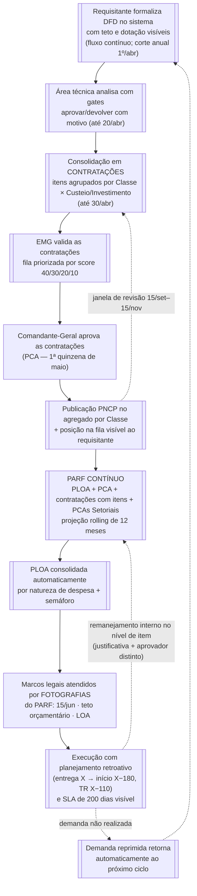

# Mapeamento do Processo TO-BE — Planejamento de Contratações e Orçamento do CBMDF

> Documento de desenho do **estado futuro** do ciclo de planejamento de contratações e orçamento,
> apoiado pelo CBMDF Marketplace. Complementa o
> [Mapeamento do Processo AS-IS](mapeamento_processo_as_is.md): o AS-IS descreve como o processo
> funciona hoje segundo as Portarias nº 18/2025 e nº 17/2025; este documento descreve como o
> processo passa a operar quando instrumentado pelo produto — e por que cada mudança agrega valor
> público. As propostas que **divergem da normativa vigente** estão registradas na seção 8.

> **Nota terminológica:** este documento adota **PLOA** (Proposta de Lei Orçamentária Anual) como
> termo único para a proposta orçamentária — a Portaria nº 17/2025 a denomina "POA", mas trata-se
> do mesmo instrumento.

---

## 1. Objetivo, método e relação com o AS-IS

O TO-BE preserva os marcos legais do ciclo (1º/abr, 30/abr, 1ª quinzena de maio, 15/jun, janela
15/set–15/nov), os papéis (requisitante, área técnica, DEALF, EMG, Comandante-Geral) e os
artefatos formais (DFD, ETP, TR, PCA, PARF, PLOA). O que muda é o **modo de operar**: onde hoje há
planilha, redigitação e informação que não circula, passa a haver dado estruturado, consolidação
derivada e visibilidade para todos os papéis. Em alguns pontos, o modelo futuro **vai além do que
a norma atual prevê** — nesses casos a divergência é explicitada na seção 8, para subsidiar a
atualização das portarias.

Cada mudança segue uma trinca rastreável:

> **Dor/risco documentado** (AS-IS + evidência de campo) → **prática de referência** (TCU iGG /
> boas práticas) → **mecanismo no produto** (épico/HU do Documento de Visão).

As evidências vêm da própria documentação do projeto:

| Fonte | O que fornece |
|---|---|
| [mapeamento_processo_as_is.md](mapeamento_processo_as_is.md) | Linha de base normativa e pontos de atenção (§8) |
| [pesquisa_servidores_2026.md](pesquisa_servidores_2026.md) | Dores de campo com 20 servidores (evidência quantitativa) |
| [contribuicoes_anotacoes_selof.md](contribuicoes_anotacoes_selof.md) / [atribuicoes_selof_implementacoes_futuras.md](atribuicoes_selof_implementacoes_futuras.md) | Visão de quem consolida o processo (SELOF) e lacunas regimentais F1–F8 |
| [tcu_matrizes_relevancia_para_o_produto.md](tcu_matrizes_relevancia_para_o_produto.md) + [anexos TCU E/F](anexos/) | Práticas de governança de contratações e orçamento (iGG) |
| [boas_praticas_orcamentaria_financeira_logistica.md](boas_praticas_orcamentaria_financeira_logistica.md) | Referências de setor público/privado e benchmarks |
| [documento_de_visao.md](documento_de_visao.md) + [registro_de_evolucao.md](registro_de_evolucao.md) | Capacidades do produto (épicos/HUs) e decisões de desenho |

### 1.1 Conceitos-chave do estado futuro

| Conceito | Definição no TO-BE |
|---|---|
| **Pedido (DFD)** | Demanda estruturada do requisitante, com itens CATMAT/CATSER, valores e datas |
| **Contratação** | Unidade de consolidação e decisão: agrupamento dos pedidos aprovados pelas áreas técnicas, com itens agrupados por **Classe de Material/Serviço × Tipo de Despesa (Custeio/Investimento)** |
| **PCA** | Conjunto das Contratações do exercício; publicado no PNCP no **agregado por Classe** |
| **PCA Setorial** | A fatia do PCA sob responsabilidade de cada órgão setorial/área técnica — visão viva que compõe o PCA corporativo (formaliza o que a planilha do Suplemento 204 já evidencia por setorial) |
| **PLOA** | Proposta orçamentária do CBMDF, consolidada por natureza de despesa a partir do banco de demandas |
| **PARF** | **Junção da PLOA + PCA + contratações previstas (com seus itens) + PCAs Setoriais.** Documento **contínuo**, em constante atualização, projetando sempre os **12 meses seguintes** — não há mais versões estanques; marcos legais são atendidos por **fotografias** datadas do documento vivo |

---

## 2. Princípios de desenho do estado futuro

1. **Fila única e transparente** — substitui o padrão "quem chega primeiro leva o orçamento"
   (problema-raiz declarado pela SELOF em `contribuicoes_anotacoes_selof.md`) por uma fila de
   Contratações priorizada por critérios institucionais, com posição visível a todos.
2. **Teto visível desde a origem** — o requisitante conhece o limite orçamentário e a dotação da
   sua unidade **antes** de formalizar a demanda, eliminando o PCA "lista de papai noel" (75% dos
   servidores citam indefinição de recursos — pesquisa §2.1).
3. **O dado nasce estruturado uma vez** — a demanda entra como DFD estruturado e flui até
   Contratação, PCA, PARF e PLOA por **derivação**, sem redigitação nem planilha intermediária.
4. **Planejamento contínuo (rolling 12 meses)** — o PARF projeta sempre os 12 meses seguintes e é
   atualizado por eventos, não por versões (rolling forecast — boas práticas §5.4); os marcos
   legais viram momentos de fotografia, não documentos separados.
5. **Dupla granularidade** — para fora (PNCP), o agregado por **Classe** cumpre a publicidade;
   para dentro (PARF), o **nível de item** dá versatilidade ao remanejamento interno de demandas
   sem ruído externo.
6. **Gestão por exceção** — gestores atuam sobre alertas (semáforo, urgências, SLA estourando),
   não sobre conferência manual linha a linha (anotação SELOF 2.8; boas práticas §3.4).
7. **Segregação de funções e motivação explícita** — todo desvio do fluxo padrão (urgência,
   override de prioridade, remanejamento) exige justificativa registrada e aprovador distinto do
   autor (Lei 14.133/2021; boas práticas §3.2; TCU 4310).
8. **Transparência ativa** — publicações (PNCP, fotografias do PARF) derivam automaticamente da
   trilha de auditoria, nunca de retrabalho manual (LRF art. 48; TCU Apêndice F).

---

## 3. Visão geral do processo TO-BE

Os marcos legais do ciclo anual permanecem; os nós destacados (`[[...]]`) indicam onde o produto
instrumenta a etapa:

---

## 4. O ciclo fase a fase (AS-IS → TO-BE)

### 4.1 Formalização da demanda (DFD)

| Dimensão | Como é hoje (AS-IS) | Como passa a ser (TO-BE) |
|---|---|---|
| Instrumento | "Instrumento padronizado" em documento/planilha, tramitado via SEI (Art. 9º, Portaria 18) | Wizard de 4 passos no sistema: selecionar itens → informar necessidade → revisar → confirmar (Épico 01; `prd_manutencao_ux.md` E4/HU09) |
| Momento | Esforço concentrado até 1º/abr | **Fluxo contínuo**: DFD formalizável a qualquer momento, vinculado automaticamente ao exercício/janela cabível; o corte de 1º/abr permanece como gate do ciclo anual |
| Classificação | Requisitante consulta o catálogo por conta própria; classe/grupo nem sempre corretos | Catálogo CATMAT/CATSER embutido; `classeCodigo`/`grupoCodigo` preservados desde a origem (`registro_de_evolucao.md`, PGC Etapa 1) |
| Visibilidade de recursos | Teto invisível; 75% citam indefinição de recursos; PCA vira "lista de papai noel" (pesquisa §2.1, §5.2-A) | Teto da unidade e matriz de dotação (prevista × atual × lacuna) exibidos **no momento da criação** (Épico 09; pesquisa §5.1 — o dado já existe, passa a chegar a quem pede) |
| Expectativa de prazo | Requisitante não sabe quanto demora; processos >500 dias na PODON (pesquisa §5.2-B) | SLA institucional de 200 dias por etapa (5/15/45/60/45/30) exibido desde a formalização (documento de visão §8.1) |

**Valor público:** demandas realistas na entrada reduzem a superestimativa defensiva apontada pelo
TCU como causa de orçamento incremental (Apêndice F, 4415) e encurtam o ciclo de consolidação.

### 4.2 Análise pela área técnica

| Dimensão | AS-IS | TO-BE |
|---|---|---|
| Devolução de demandas | Informal, sem padrão; retrabalho e "orçamentos vencendo" (pesquisa §5.2-E) | Gates explícitos `DFD Aprovado pela Unidade` / `DFD Devolvido para Ajuste`, sempre com motivo registrado (PGC Etapa 2; pipeline de 25 status — Épico 02) |
| Padronização | Cada área técnica com seu checklist (ou nenhum) | Checklist embutido no gate; campos obrigatórios do DFD validados pelo sistema antes do envio |
| Visão setorial | Planilha própria de cada setorial, consolidada manualmente ao final | **PCA Setorial**: cada área técnica mantém sua fatia viva do PCA, que compõe o corporativo por derivação |
| Comunicação | Nota 2,85/5, com a ponta operacional no fundo da escala (pesquisa §2.2) | Ponto focal por etapa visível no acompanhamento do pedido (endereça pesquisa §5.2-F) |

### 4.3 Consolidação em Contratações e composição do PCA (DEALF)

| Dimensão | AS-IS | TO-BE |
|---|---|---|
| Unidade de consolidação | Linhas de planilha por setorial — evidência: anexo da Portaria nº 34/2025 (AS-IS §7–§8) | Pedidos analisados e aprovados pelas áreas técnicas são consolidados em **Contratações**, com itens agrupados por **Classe de Material/Serviço × Tipo de Despesa (Custeio/Investimento)** — derivação automática, com rastreio dos DFDs de origem (PGC Etapa 3; Épico 03) |
| Granularidade externa | Publicação em bloco, quando ocorre | Para o **PNCP**, o PCA é composto do **agregado por Classe** — é esse o nível publicado |
| Granularidade interna | A planilha é o único registro; mexer nela é retrabalho | Para o **PARF**, a visibilidade vai até o **nível de item** — permitindo remanejamento interno de demandas entre unidades/prioridades **sem alterar o agregado publicado**, desde que dentro da mesma Classe × Tipo de Despesa |
| Priorização | Matriz GUT aplicada de forma não padronizada por setorial; "tudo fica priorizado" (SELOF, pesquisa §3) | Score institucional único por Contratação: 40 criticidade / 30 risco / 20 obrigatoriedade legal / 10 prontidão, com decomposição "Por quê?" e desempate estável (HU08.1) |
| Ciclos | Um esforço concentrado em abril + revisões pontuais | Ciclos quadrimestrais com ata e fotografia congelada (HU08.3); janela formal 15/set–15/nov sinalizada no sistema (HU08.7) |

**Valor público:** aderência direta às práticas TCU **4330/4340** (planejamento das contratações e
processo de trabalho — as duas de aderência "muito forte" na matriz do produto) e **4421/4422**
(prioridades conhecidas **e tratadas**). A dupla granularidade evita os efeitos listados pelo TCU
(fracionamento de despesa, PAC intempestivo/desatualizado) sem engessar a gestão interna.

### 4.4 Validação (EMG) e aprovação (Comandante-Geral) das contratações

| Dimensão | AS-IS | TO-BE |
|---|---|---|
| Objeto da decisão | Planilha consolidada de itens; reprovações pouco rastreáveis (Art. 14, Portaria 18) | **Contratações** — cada uma com seus itens, score decomposto e DFDs de origem; devolução ao DEALF vira transição registrada na trilha |
| Ajuste de prioridade | Informal | Override possível, mas com **custo político registrado**: quem passa na frente exibe quem foi preterido; override expira no ciclo seguinte (HU08.2) |
| Contratações inviáveis | "Banco de projetos" estático para consulta futura (Art. 14, §2º) | Demanda reprimida **retorna automaticamente** ao próximo ciclo, sem reentrada manual (anotação SELOF 2.2) |

### 4.5 Publicação e transparência das contratações

| Dimensão | AS-IS | TO-BE |
|---|---|---|
| Publicação | Manual no site do CBMDF e, quando possível, PGC/PNCP (Art. 15, § único) | Estado "publicado no PNCP" **derivado da trilha do gate formal**, no agregado por Classe; a cada aprovação de contratação, a publicação correspondente é atualizada — sem lote manual (PGC Etapa 4) |
| Visibilidade interna | Requisitante não sabe a posição da sua demanda | Posição da Contratação na fila e critério de ordenação visíveis ao requisitante (HU08.6) — responde às 3 perguntas da pesquisa §5.1 |

**Valor público:** transparência ativa (LRF art. 48; boas práticas §6.4) e redução da assimetria
de informação que hoje penaliza a ponta operacional (pesquisa §2.2).

### 4.6 PARF contínuo

O PARF deixa de ser um documento com versões estanques e passa a ser a **junção viva de quatro
camadas**: a PLOA, o PCA, as contratações previstas (com seus itens) e os PCAs Setoriais.

| Dimensão | AS-IS | TO-BE |
|---|---|---|
| Natureza | Documento com 3 versões formais (Art. 12–14, Portaria 17) — na prática já extrapoladas: a Portaria nº 34/2025 aprovou uma 4ª versão (AS-IS §8) | **Documento contínuo**, em constante atualização, projetando sempre os **12 meses seguintes** (rolling — boas práticas §5.4). A 4ª versão do AS-IS é o próprio sintoma de que o modelo de versões não comporta a realidade |
| Instrumento | Planilha da SELOF; sem instrumento sistêmico (lacuna regimental **F3**, `atribuicoes_selof_implementacoes_futuras.md` §6) | **Módulo PARF**: distribuição por unidade/classe derivada das Contratações aprovadas + folhas informadas por DIGEP/DINAP/DIOFI, com visibilidade até o nível de item |
| Marcos legais | Cada versão é um documento separado, aprovado por Portaria | Marcos (15/jun, +30d do teto, +10d da LOA) atendidos por **fotografias datadas** do documento vivo, submetidas à aprovação formal — a fotografia congela o estado, o documento segue vivo *(ver divergência D1, seção 8)* |
| Remanejamento | Ajustes em planilha, sem trilha | Remanejamento **no nível de item**, com justificativa obrigatória + **aprovador distinto do solicitante** + registro na trilha (F3; segregação — TCU 4310); dentro da mesma Classe × Tipo de Despesa, não altera o agregado publicado no PNCP |

### 4.7 PLOA e receitas

| Dimensão | AS-IS | TO-BE |
|---|---|---|
| Consolidação por natureza | SELOF reclassifica manualmente demandas em naturezas de despesa | Consolidação **automática** por natureza de despesa a partir do banco de demandas estruturado (dashboards PLOA — Épico 04; boas práticas §5.5) |
| Sinalização | Sem visão rápida do enquadramento de cada item | Semáforo por item: **Verde** (dentro da PLOA) / **Amarelo** (coberto por ARP) / **Vermelho** (apenas no rol de demandas) — anotação SELOF 2.1 |
| Fontes e emendas | Fontes (FCDF, FUNCBM, emendas) controladas fora do fluxo | Fonte de recurso como dimensão do dado; **Caderno de Emendas gerado do banco de demandas** (F4) — a demanda estruturada vira insumo de captação |

### 4.8 Execução e monitoramento

| Dimensão | AS-IS | TO-BE |
|---|---|---|
| Prazo de 180 dias | Regra existe (Art. 20, §3º, Portaria 18), mas o controle é de cada área; risco de vencimento dos 180 dias da planilha orçamentária (art. 97, Decreto 44.330/2023 — pesquisa §5.2-C) | **Planejamento retroativo**: da data de entrega desejada X, o sistema deriva início ≤ X−180 e TR ≤ X−110, com alertas (anotação SELOF 2.6) |
| Acompanhamento | Relatórios de risco bimestrais montados manualmente (Art. 21) | Relatórios alimentados pelo pipeline: contratações sem movimentação, SLA estourado por etapa, cobertura da dotação — gestão por exceção (SELOF 2.8) |
| Urgências | Ciclo vicioso: emergencial fura a fila → fila para → nova emergência (COMAP, pesquisa §5.2-D) | Urgência exige justificativa + 2º aprovador (HU08.4); painel por setor com meta ≤10% e alerta acima de 20% (HU08.5) |
| Aprendizado entre ciclos | Contratações não realizadas são justificadas ao fim do ano (Art. 21, §4º) | Demanda reprimida flui automaticamente para o ciclo seguinte, e o orçado × realizado alimenta o PARF contínuo (boas práticas §6.1) |

**Valor público:** ataca diretamente o efeito "número elevado de contratações emergenciais" (TCU
Apêndice E, 4330) — benchmark citável: Belo Horizonte reduziu compras emergenciais em ~25% com
planejamento integrado (boas práticas).

---

## 5. Papéis no TO-BE — o que muda na prática

| Papel | Competência normativa (base) | O que muda na operação |
|---|---|---|
| **Requisitante** | Formaliza a demanda (Art. 9º, Portaria 18) | Formaliza no sistema a qualquer momento, vendo teto, dotação, SLA e a posição da sua Contratação na fila — deixa de "pedir no escuro" |
| **Área técnica** (COMOP, DITIC, DIREN, DISAU, DIMAT) | Analisa, agrupa, padroniza (Art. 11) | Opera gates com motivo registrado e mantém o seu **PCA Setorial** como visão viva que compõe o corporativo |
| **DEALF** (Gestor do PCA) | Consolida o PCA (Art. 3º, 13) | Deixa de montar planilha; **valida a consolidação em Contratações** (Classe × Tipo de Despesa) e gere o calendário de contratação por score |
| **EMG** (Coordenador do PCA; Gestor do PARF) | Valida o PCA; elabora o PARF e a PLOA (Art. 14; Portaria 17, Art. 3º) | Valida **contratações** em fila priorizada com trilha; conduz o **PARF contínuo** e suas fotografias nos marcos legais |
| **SELOF** | Elabora a Proposta Orçamentária (Portaria 17, Art. 8º) | Ganha o módulo PARF (F3) e a consolidação automática por natureza; sai do papel de "redigitadora" para o de curadora do dado |
| **Comandante-Geral** | Aprova PCA e PARF (Art. 15 de ambas) | Aprova **contratações** e **fotografias do PARF** com visibilidade da decomposição de prioridades e do custo político de overrides |
| **DIMAT / DICOA** | TR/Projeto Básico e licitação (Art. 22–24) | Recebem processos com antecedência garantida pelo planejamento retroativo e fila previsível |
| **DIGEP / DINAP / DIOFI / DISAU** | Fornecem dados de folha, execução e reservas (Portaria 17, Art. 6º, 8º, 18) | Alimentam o módulo PARF diretamente, em vez de trocar planilhas em pontos de sincronização manual (AS-IS §8) |

---

## 6. Mapa de rastreabilidade: dor → prática → mecanismo

| # | Dor/risco (evidência) | Prática de referência | Mecanismo no produto |
|---|---|---|---|
| 1 | Teto invisível; PCA "lista de papai noel" — 75% (pesquisa §2.1, §5.2-A) | TCU 4415 (previsão adequada); boas práticas §2.2 | Teto + matriz de dotação na criação do DFD (Épicos 01/09) |
| 2 | "Quem chega primeiro leva o orçamento" (SELOF, panorama) | TCU 4421/4422 (prioridades conhecidas e tratadas) | Fila única de Contratações com score 40/30/20/10 + posição visível (Épico 08) |
| 3 | GUT não padronizada; "tudo fica priorizado" (pesquisa §3) | Boas práticas §2.2 (critérios objetivos) | Score institucional único com decomposição (HU08.1) |
| 4 | Consolidação manual em planilha (AS-IS §7–8; Portaria 34/2025) | Boas práticas §5.5 (automatizar consolidações); TCU 4340 | Consolidação derivada em Contratações por Classe × Tipo de Despesa (Épico 03) |
| 5 | Retrabalho e orçamentos vencidos por devolução informal (pesquisa §5.2-E) | TCU 4411 (processo definido); boas práticas §3.4 | Gates DFD aprovar/devolver com motivo (PGC Etapa 2) |
| 6 | Processos >500 dias; SLA invisível (pesquisa §5.2-B) | TCU 4412 (indicadores); boas práticas §6.2 | SLA 200 dias por etapa, visível a todos (documento de visão §8.1) |
| 7 | Risco de vencimento dos 180 dias (art. 97, Decreto 44.330/2023 — pesquisa §5.2-C) | Boas práticas §2.3 (cronogramas integrados) | Planejamento retroativo X−180 / X−110 com alertas (SELOF 2.6) |
| 8 | Ciclo vicioso emergencial (COMAP, pesquisa §5.2-D) | TCU 4330 (evitar emergenciais); benchmark BH −25% | Contenção de urgência: 2º aprovador + meta ≤10% (HU08.4/08.5) |
| 9 | PARF sem instrumento sistêmico; versões extrapoladas na prática (F3; AS-IS §8) | Rolling forecast (boas práticas §5.4); TCU 4411; segregação (4310) | **PARF contínuo** rolling 12m: fotografias nos marcos legais + remanejamento por item com aprovador distinto e trilha (F3) |
| 10 | Comunicação nota 2,85/5; ponta operacional no escuro (pesquisa §2.2) | LRF art. 48; boas práticas §6.4 | Acompanhamento com posição, ponto focal e trilha (HU08.6; Épico 02) |
| 11 | Demanda reprimida se perde entre exercícios (Art. 21, §4º operado manualmente) | Rolling forecast (boas práticas §5.4) | Retorno automático ao próximo ciclo (SELOF 2.2) |
| 12 | Publicação manual e defasada (Art. 15) | TCU Apêndice F (transparência) | Publicação PNCP por Classe, derivada da trilha e atualizada por evento (PGC Etapa 4) |
| 13 | Remanejar demanda interna exige refazer a consolidação inteira (AS-IS §8, planilha) | Boas práticas §3.4 (eliminar retrabalho sem valor) | Dupla granularidade: PNCP por Classe, PARF por item — remanejamento sem republicação (§4.3/§4.6) |

---

## 7. O que o TO-BE não muda

- **Marcos temporais do ciclo** — os prazos das portarias (1º/abr, 20/abr, 30/abr, maio, 15/jun,
  janela 15/set–15/nov, 180/120 dias de antecedência) permanecem como gates e momentos de
  aprovação/fotografia.
- **Alçadas de aprovação** — validação pelo EMG e aprovação pelo Comandante-Geral permanecem
  (com a ressalva da proposta de delegação D2, seção 8).
- **Fronteiras de sistema** (conforme [analise_escopo_erp.md](analise_escopo_erp.md)): custódia
  logística e patrimônio no **Grifo/SISGEPAT**; execução financeiro-contábil (empenho, liquidação,
  pagamento) no **SIAFI**; tramitação documental no **SEI**; publicidade oficial no **PNCP**;
  licitação/pregão fora do escopo do produto. O Marketplace planeja, orquestra e integra — não
  substitui esses sistemas.
- **Papéis de pessoal/folha** — GSV e rubricas de pessoal continuam nos fluxos próprios (SELOF §3,
  fora de escopo).

---

## 8. Otimizações propostas e divergências com a normativa vigente

Campo dedicado exigido pelo método deste documento: toda otimização que **contraria a norma
atual** está listada como **D***n* (divergência — requer atualização normativa); as compatíveis
estão como **O***n* (otimização dentro da norma).

### 8.1 Divergências — exigem atualização das portarias

| # | Otimização | Benefício | Conflito normativo | Encaminhamento |
|---|---|---|---|---|
| **D1** | **PARF contínuo (rolling 12 meses), sem versões** — marcos legais atendidos por fotografias datadas do documento vivo | Elimina o descompasso já observado na prática (4ª versão fora do rito — Portaria nº 34/2025); projeção permanente de 12 meses; rastreabilidade total de cada mudança | Portaria nº 17/2025, Art. 2º ("composto por três versões") e Art. 12–15 (rito de envio/aprovação por versão) | Nova Portaria definindo o PARF como instrumento contínuo, com fotografias aprovadas pelo Comandante-Geral nos marcos hoje existentes (15/jun, teto, LOA) — preserva as alçadas, muda o formato |
| **D2** | **Remanejamento interno por alçada** — mudanças no nível de item, dentro da mesma Classe × Tipo de Despesa e sem alterar o total da Contratação, aprovadas pelo EMG (sem novo ato do Comandante-Geral) | Agilidade no remanejamento interno de demandas (a "versatilidade" que motiva a visibilidade por item); Comandante-Geral decide o que é estratégico, não o operacional | Portaria nº 18/2025, Art. 17 (alteração do PCA em execução aprovada pelo Comandante-Geral); Portaria nº 17/2025, Art. 15 (aprovação do PARF pelo Comandante-Geral) | Ato de delegação formal definindo alçadas: nível de item/mesma Classe → EMG; mudança de Classe, de Tipo de Despesa ou de total → Comandante-Geral |
| **D3** | **Fim do envio de demandas por prazo único** como única porta — entrada contínua de DFDs com vinculação automática ao exercício cabível | Reduz o pico de abril e a corrida de fim de prazo; demandas maduras entram quando estão prontas | Divergência **parcial**: o Art. 9º da Portaria nº 18/2025 fixa "até 1º de abril" como obrigação de envio; a leitura contínua exige reinterpretação (1º/abr passa a ser o **corte de consolidação**, não a única janela de entrada) | Ajuste redacional na futura revisão da Portaria nº 18, mantendo 1º/abr como data-corte do ciclo anual |

### 8.2 Otimizações compatíveis com a norma vigente

| # | Otimização | Benefício | Base normativa que já a comporta |
|---|---|---|---|
| **O1** | **Publicação PNCP por evento** — a cada contratação aprovada, o agregado por Classe é atualizado automaticamente | PCA público sempre atual; elimina o efeito TCU "PAC desatualizado/não publicado" | Art. 15, § único, Portaria 18 já manda "divulgar e manter à disposição do público" |
| **O2** | **PCAs Setoriais como visão viva** — cada área técnica enxerga e gere sua fatia do PCA em tempo real | Formaliza o que a planilha do Suplemento 204 já faz por setorial, sem o custo da consolidação manual | Art. 11, Portaria 18 já atribui às áreas técnicas a consolidação setorial |
| **O3** | **Relatórios de risco derivados do pipeline** — os relatórios bimestrais (jul/set/nov) saem do sistema, não de coleta manual | Reuniões do Art. 21 focam em decisão, não em montagem de dados | Art. 21, Portaria 18 define o rito; não prescreve o meio |
| **O4** | **Banco de projetos como fila de demanda reprimida** — itens inviáveis retornam automaticamente ao ciclo seguinte | Nada se perde entre exercícios; atende SELOF 2.2 | Art. 14, §2º e Art. 21, §4º, Portaria 18 já preveem banco de projetos e reincorporação |
| **O5** | **Planejamento retroativo automatizado (X−180 / TR X−110)** | Cumprimento sistemático do Art. 20, §3º; mitiga o risco do art. 97 do Decreto 44.330/2023 | Automatiza regra existente — nenhuma mudança de norma |
| **O6** | **Fotografia congelada com ata em cada ciclo quadrimestral de priorização** | Decisões de priorização auditáveis entre os marcos legais | Não regulado — prática interna de governança (HU08.3) |

---

## 9. Condições para o TO-BE se realizar

O estado futuro descrito depende de itens já mapeados como pendentes na documentação do projeto —
listados por referência, sem duplicar:

- **Coerências C1–C6** da [auditoria_coerencia_prototipo.md](auditoria_coerencia_prototipo.md)
  (gate formal × atalho setorial, urgência × criticidade, inclusão manual sem DFD, mistura de
  exercícios na fila, três telas de dinheiro, herança "marketplace").
- **Exposição de teto e SLA ao solicitante** — o dado já é calculado, falta chegar à ponta
  (auditoria §3.3; é a mudança de maior retorno imediato segundo a pesquisa §5.1).
- **Modelagem da entidade Contratação e da dupla granularidade** (Classe para PNCP, item para
  PARF) — evolução do modelo de "item de PCA por exercício×classe" já implementado (Épico 03).
- **Módulo PARF contínuo** (F3) com fotografias datadas e remanejamento por alçada.
- **RBAC e backend real** (auditoria §7.1) — hoje o protótipo é estático com `localStorage`.
- **Integrações** ainda inexistentes: PGC/Siasg, Grifo/SISGEPAT, SIAFI (auditoria §8.3).
- **Atualização normativa** das divergências D1–D3 (seção 8.1).
- **Épicos futuros**: 05 (ARP), 06 (IA), 10 (catálogo de indicadores/PLANES — F6), além de F1
  (horizonte plurianual/PPA), F2 (programa/ação como dimensão) e F5 (E-PACC).

---

## 10. Indicadores de sucesso do estado futuro

Partem dos 5 KPIs do [documento_de_visao.md](documento_de_visao.md) §8 e ganham candidatos vindos
das evidências deste mapeamento:

| Indicador | Linha de base (evidência) | Meta TO-BE |
|---|---|---|
| % de contratações por urgência/emergência | Ciclo vicioso relatado (pesquisa §5.2-D) | ≤ 10% por setor (HU08.5); alerta > 20% |
| Aderência ao SLA de 200 dias | Casos > 500 dias (PODON, pesquisa §5.2-B) | SLA por etapa cumprido; desvios tratados por exceção |
| % de demandas dentro do teto na origem | PARF ~5× a execução em unidades como o GPRAM (pesquisa §5.2-A) | Demanda formalizada ≈ capacidade orçamentária real |
| Processos iniciados com ≥180 dias de antecedência | Controle manual, risco do art. 97 (pesquisa §5.2-C) | 100% das contratações com início ≤ X−180 |
| Comunicação percebida pelo requisitante | Nota 2,85/5 (pesquisa §2.2) | Reavaliar na próxima pesquisa após exposição de teto/posição/SLA |
| Rastreabilidade do PARF contínuo | 4ª versão fora do rito (Portaria 34/2025); ajustes de planilha sem trilha | 100% dos remanejamentos com justificativa, aprovador distinto e trilha; PARF projetando 12 meses à frente em qualquer data de consulta |
| Atualidade da publicação no PNCP | Publicação manual, sujeita a defasagem (efeito TCU "PAC desatualizado") | Agregado por Classe atualizado automaticamente a cada contratação aprovada |
